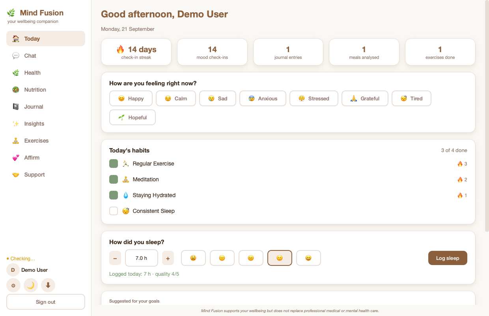
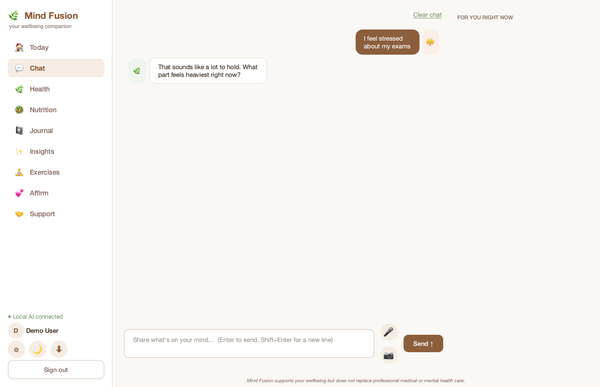

<div align="center">

# 🌿 Mind Fusion

**A privacy-first mental wellbeing companion powered entirely by local AI**

*Mood tracking · Journaling · Nutrition analysis · Guided exercises · Insights — with every AI feature running on-device, never in the cloud.*

[Overview](#overview) · [Getting Started](#getting-started) · [Live Demo](#live-demo) · [Screenshots](#screenshots) · [Features](#features) · [Tech Stack](#tech-stack) · [Testing & Evidence](#testing--evidence)

</div>

---

## Overview

**Mind Fusion** is a mental wellbeing application built in two stages as part of a final-year project:

1. **`src/`** — the original **web prototype**, a React 19 + Vite single-page app that established the product's design and UX, and has since been brought up to close visual and functional parity with the desktop app (same sidebar navigation, Today dashboard, dark mode, and full Chat / Nutrition / Exercises / Insights behaviour), persisted in the browser's `localStorage`.
2. **`desktop_app/`** — the **production build**: a native **desktop application** rewritten from scratch in **Python (PySide6 / Qt + SQLite)**, adding local speech-to-text and live facial-expression detection on top of everything the web app has — all running as a real, installable desktop program rather than a browser tab.

The defining constraint of this project is **data sovereignty**: every AI capability — conversational support, meal-photo analysis, speech transcription and facial emotion recognition — runs on **models installed locally on the user's own machine**. No user message, photo, voice recording, or journal entry is ever sent to a third-party or cloud AI provider (no OpenAI, no Claude, no Gemini). The application talks only to a local model server ([Ollama](https://ollama.com) by default) on `localhost`.

> The desktop application (`desktop_app/`) is the primary, evaluated deliverable of this project. The React app remains the original prototype, kept up to date so the design can be tried without installing anything.

---

## Getting Started

### Prerequisites
- **Python 3.11+** (developed and tested on 3.14) for the desktop app
- **Node.js 18+** for the web prototype
- **[Ollama](https://ollama.com)** installed, for local AI inference

### Desktop application (recommended)

```bash
cd desktop_app
python3 -m venv venv
source venv/bin/activate        # Windows: venv\Scripts\activate
pip install -r requirements.txt

ollama serve
ollama pull llama3.2             # chat model — llava (vision) auto-downloads on first meal-photo use

python main.py
```

Speech-to-text and facial-emotion models download automatically, once, the first time each feature is used. Full setup notes, project layout and per-tab documentation are in **[`desktop_app/README.md`](desktop_app/README.md)**.

### Web prototype

```bash
npm install
npm run dev
```

---

## Live Demo

### 👉 [zxsomyaa.github.io/mind-fusion-ai](https://zxsomyaa.github.io/mind-fusion-ai/)

**This is a UI/UX demo only — no AI model runs behind it.** It's a static build of `src/` with nothing to install, so you can sign up, go through onboarding, and click through every tab (Today, Chat, Nutrition, Journal, Insights, Exercises, Affirm, Support, dark mode) to see the interface and interaction design. But Chat won't hold a real conversation and Nutrition won't actually analyse a photo, because there is no AI model connected on the hosted page — GitHub Pages only serves static files, and the local models this project relies on (Ollama, Whisper, YuNet/FER+) all need to run on an actual machine, not a web server.

The two desktop-only capabilities — the live camera mood check and real local Whisper speech-to-text — also aren't present here (the web build substitutes the browser's own Web Speech API for voice input, where supported).

For the real, working application — chat replies, meal analysis, the lot — see [Getting Started](#getting-started) above.

<details>
<summary>Advanced: pointing the demo at your own local Ollama (not guaranteed to work)</summary>

The page's JS calls `http://localhost:11434` from your own browser, so if you have Ollama running on the same machine, it may be reachable — but Ollama blocks cross-origin browser requests by default, and modern browsers add further restrictions on a public HTTPS page reaching into `localhost`. If you want to try it anyway:

```bash
OLLAMA_ORIGINS=https://zxsomyaa.github.io ollama serve
```

Treat this as an experiment, not a supported way to use the app.
</details>

---

## Screenshots

| Today dashboard | Chat companion |
|:---:|:---:|
|  |  |

More screens (nutrition, insights, exercises, dark mode, onboarding, journal) are in [`desktop_app/screenshots/`](desktop_app/screenshots/).

---

## Features

- **Onboarding & accounts** — sign-up/sign-in with a 5-step profile wizard (location, age, health conditions, habits, goals); returning users skip straight to their data.
- **🏠 Today** — greeting, check-in streak, one-tap mood check-in, habit checklist, sleep log, a personalised suggestion, and a daily affirmation.
- **💬 Chat** — a local-LLM companion with persisted history, a reply-language picker (English, Hindi, Hinglish and more), speech-to-text, a crisis-support banner, and a scripted offline fallback if the AI server is unreachable.
- **📓 Journal** — writing prompts, live mood tagging, search and mood filtering.
- **🍽️ Nutrition** — drop in a meal photo for a local vision model's estimate of calories, macros and balance, plus daily totals and a meal log.
- **📊 Insights** — 7/30/90-day/all-time analytics: KPIs vs. the previous period, plain-language findings, mood mix/trend/calendar charts, habit consistency, and nutrition/exercise/journal summaries.
- **🧘 Exercises** — seven guided breathing/grounding practices with session logging, plus manual logging for anything done outside the app.
- **Also** — dark mode, one-click JSON data export, and a settings panel supporting Ollama, LM Studio, or any OpenAI-compatible local server.

Desktop-only extras: a live camera window for facial-expression mood detection, and real local Whisper transcription (the web app substitutes the browser's own speech recognition).

---

## Tech Stack

| Layer | Technology |
|---|---|
| Desktop UI | Python 3.14, **PySide6 (Qt 6)** |
| Persistence | **SQLite** (single-file, zero-config, `mind_fusion.db`) |
| Conversational AI | **Ollama** — Llama 3.2 / Mistral (user-selectable), served locally |
| Meal-photo analysis | **LLaVA** vision-language model, served locally via Ollama |
| Speech-to-text | **faster-whisper** (`base`, int8, CPU) |
| Face detection | **YuNet** (OpenCV `FaceDetectorYN`, ONNX) |
| Facial emotion classification | **FER+** (8-category emotion model, ONNX via `onnxruntime`) |
| Charts & analytics UI | Hand-drawn with Qt `QPainter` (no charting library dependency) |
| Testing | `pytest` / `unittest`, 101 automated tests |
| — | — |
| Web prototype UI | React 19, Vite 8, hand-rolled inline styles (no CSS framework) |
| Web prototype persistence | Browser `localStorage` (per-device; nothing is sent to a server) |
| Web prototype voice input | Browser Web Speech API, where supported — a substitute for the desktop app's local Whisper |
| Web prototype charts | Hand-rolled SVG (`src/components/charts.jsx`) — a JS/SVG port of the same `RingGauge` / `DonutChart` / `BarChart` the desktop app draws with Qt |

## Local AI Models

Nothing in this table ever leaves the user's machine.

| Feature | Model | Runtime | Notes |
|---|---|---|---|
| Chat / mood coaching | Llama 3.2 (3.2B, Q4_K_M, ≈2.0 GB) | Ollama | Model is user-selectable in Settings (Mistral also supported) |
| Meal-photo analysis | LLaVA (7B, Q4_0, ≈4.7 GB) | Ollama | Auto-downloaded on first use of the Nutrition tab |
| Speech-to-text | Whisper `base` (≈141 MB) | faster-whisper (CPU, int8) | Auto-downloaded on first mic use |
| Facial emotion | FER+ (35 MB) + YuNet face detector (233 KB) | onnxruntime / OpenCV | Bundled in `desktop_app/models/`; substituted for DeepFace, which has no TensorFlow build for Python 3.14 |

---

## Repository Structure

```
mind-fusion-ai/
├── src/                      React + Vite web prototype (brought to parity with the desktop app)
│   ├── App.jsx                 signed-in shell: sidebar nav, theme switching, settings modal
│   ├── data.js                  static content + shared design tokens (theme-aware, see applyTheme)
│   ├── nutritionLogic.js        meal-analysis response parsing (mirrors nutrition_logic.py)
│   ├── insightsLogic.js         analytics engine (mirrors insights_logic.py)
│   ├── exerciseStorage.js       shared exercise-session log (used by Exercises and Insights)
│   └── components/              one component per feature tab, plus charts.jsx (RingGauge,
│                                 DonutChart, BarChart, LineChart, MoodCalendar) and AddExerciseModal.jsx
│
├── desktop_app/                ★ the primary deliverable — native desktop application
│   ├── main.py                 entry point
│   ├── data.py                 mood detection, recommendations, static content
│   ├── db.py                   SQLite persistence layer
│   ├── ai_client.py            local AI server client (chat / vision / model pull)
│   ├── voice.py                 local speech-to-text
│   ├── face_analysis.py        live camera + face/emotion detection
│   ├── nutrition_logic.py       meal-analysis response parsing
│   ├── insights_logic.py       analytics engine (pure Python, unit-tested)
│   ├── workers.py               background QThreads
│   ├── ui/                      Qt widgets, one file per tab (ui/tabs/)
│   ├── tests/                  101 automated tests
│   ├── evidence/                ★ independent, script-generated test-case evidence
│   │   └── SUMMARY.md            results table with file:line citations
│   ├── screenshots/             UI screenshots (light + dark)
│   └── README.md                desktop app — detailed documentation
│
└── README.md                    you are here
```

---

## Testing & Evidence

The desktop application ships **101 automated tests** (`pytest`/`unittest`) covering mood detection (English, Hindi, Hinglish), crisis-language detection, the photo loader, the live camera pipeline, the onboarding flow, the database layer, every analytics chart, and all main screens — using a temporary database and stand-ins for the AI server and camera, so the suite never touches real user data and needs no network connection.

```bash
cd desktop_app
python -m unittest discover -s tests -v
```

Beyond the unit suite, [`desktop_app/evidence/`](desktop_app/evidence/) contains **independently generated, raw evidence** for the project's test-case appendix — produced by standalone scripts that exercise the application's real code paths (not mocks) and are re-runnable by anyone:

- `pytest.txt` — the adapted component test suite, verbatim output
- `moods.txt` — expected-vs-actual mood detection across 12 phrases
- `database_*.txt` — SQLite proof that onboarding data and journal entries persist across a process restart
- `output/05_no_audio_file.txt` — filesystem proof that a voice check-in never writes an audio file to disk, with a positive control
- `output/06_network_guard_*.txt` — a socket-level network guard proving which code paths do (and do not) make outbound connections
- `output/07_timing.txt` — end-to-end, per-stage latency across 20 text and 20 voice check-ins through the real chat pipeline
- `output/03*_meal_analyser*.txt` — the same meal photo analysed multiple times, and a no-food photo, to document real model behaviour

**[`desktop_app/evidence/SUMMARY.md`](desktop_app/evidence/SUMMARY.md)** ties all of this together in a single results table, with every claim traceable to a specific file and line.

---

## Privacy

No user data — messages, journal entries, mood history, meal photos or voice recordings — is transmitted to any third-party service. The only network traffic the application generates in normal use is to `localhost` (the local Ollama server) and, once, to check for a speech-to-text model update on first use. This is independently verified in [`evidence/output/06_network_guard_default.txt`](desktop_app/evidence/output/06_network_guard_default.txt).

---

## Author

**Somya Mehta** — final-year academic project.
