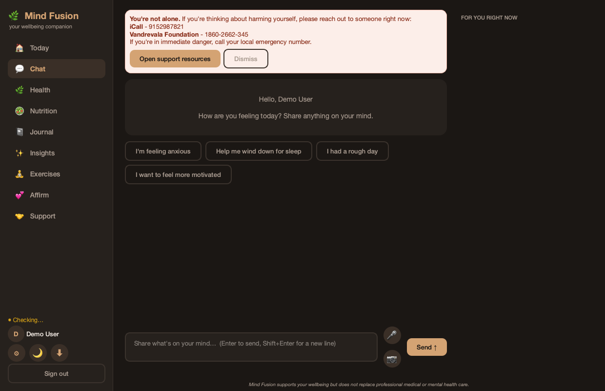
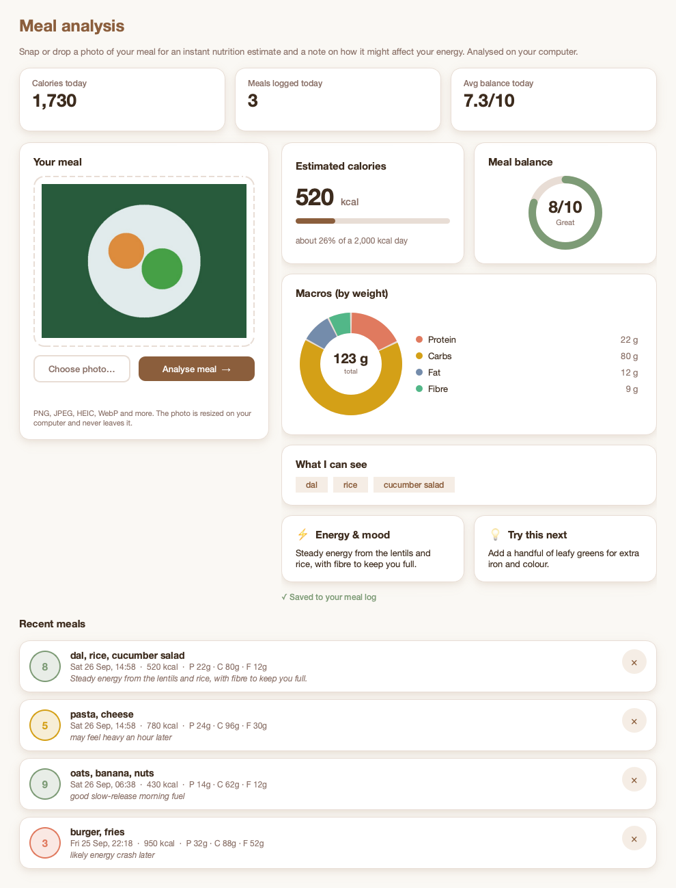
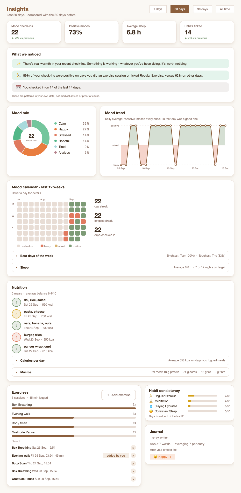
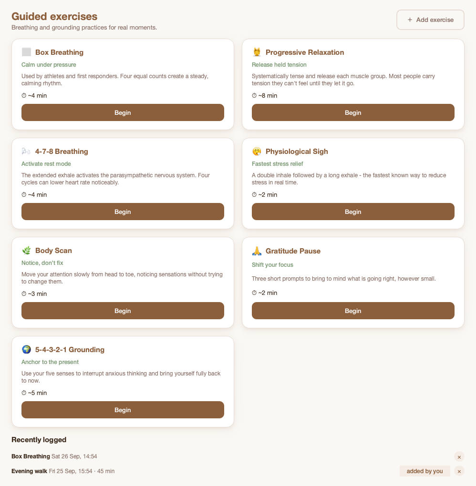
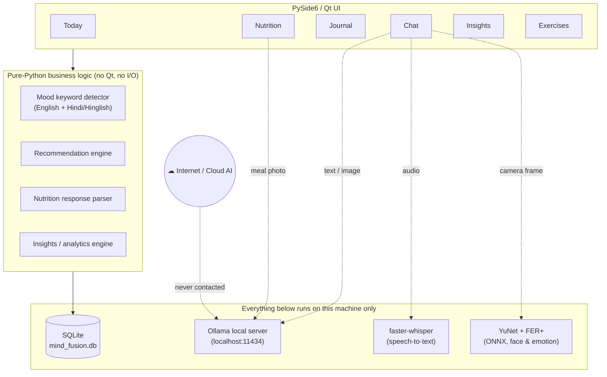

<div align="center">

# 🌿 Mind Fusion

**A privacy-first mental wellbeing companion powered entirely by local AI**

*Mood tracking · Journaling · Nutrition analysis · Guided exercises · Insights — with every AI feature running on-device, never in the cloud.*

[Overview](#overview) · [Screenshots](#screenshots) · [Features](#features) · [Architecture](#architecture) · [Tech Stack](#tech-stack) · [Getting Started](#getting-started) · [Testing & Evidence](#testing--evidence) · [Limitations](#known-limitations)

</div>

---

## Overview

**Mind Fusion** is a mental wellbeing application built in two stages as part of a final-year project:

1. **`src/`** — the original **web prototype**, a React 19 + Vite single-page app that established the product's feature set and UX.
2. **`desktop_app/`** — the **production build**: a native **desktop application** rewritten from scratch in **Python (PySide6 / Qt + SQLite)**, delivering full feature parity with the web prototype plus speech-to-text, live facial-expression detection and richer analytics — all running as a real, installable desktop program rather than a browser tab.

The defining constraint of this project is **data sovereignty**: every AI capability — conversational support, meal-photo analysis, speech transcription and facial emotion recognition — runs on **models installed locally on the user's own machine**. No user message, photo, voice recording, or journal entry is ever sent to a third-party or cloud AI provider (no OpenAI, no Claude, no Gemini). The application talks only to a local model server ([Ollama](https://ollama.com) by default) on `localhost`.

> The desktop application (`desktop_app/`) is the primary, evaluated deliverable of this project. The React app is retained as the original prototype for reference.

---

## Screenshots

| Today dashboard | Chat companion | Crisis-support alert |
|:---:|:---:|:---:|
|  |  |  |

| Nutrition analysis | Insights dashboard | Guided exercises |
|:---:|:---:|:---:|
|  |  |  |

Dark mode and additional screens (onboarding, journal, settings) are in [`desktop_app/screenshots/`](desktop_app/screenshots/).

---

## Features

### Onboarding & accounts
A welcome screen, sign-up / sign-in with inline validation, and a 5-step profile wizard (location, age group, health conditions, habits, up to 3 wellbeing goals). Returning users skip onboarding entirely — profile data is tied to the account, not the session.

### 🏠 Today
Personal greeting, check-in streak, one-tap mood check-in, a daily **habit checklist** with per-habit streaks, a **sleep log** (hours + quality), a mood-personalised suggestion, a daily affirmation, and quick-action shortcuts.

### 💬 Chat
A local-LLM wellbeing companion with:
- Conversation history persisted and replayed between sessions (last 20 messages kept in context)
- A **reply-language picker** — respond in English, Hindi, Hinglish (Hindi typed in Roman letters), Spanish, French, German and more, remembered per user
- 🎤 **Speech-to-text** via a local Whisper model
- 📷 A **live camera window** for facial-expression-based mood detection (see faces boxed in real time)
- A **crisis-support banner** that surfaces country-specific helplines when a message suggests self-harm risk
- A **scripted, on-device fallback reply** if the local AI server is unreachable — the app never surfaces a raw connection error to the user

### 📓 Journal
Free-form journaling with writing prompts, live mood tagging, and full search + mood filtering over past entries.

### 🍽️ Nutrition
Drag-and-drop (or browse) a meal photo; a local vision-language model estimates calories, macronutrients and a balance score, returns food tags, an energy/mood note, and a practical tip. Ambiguous or malformed model output is rejected with a clear message rather than guessed at. Includes daily totals and a recent-meals list.

### 📊 Insights
Configurable time windows (7 / 30 / 90 days / all time) covering headline KPIs compared against the previous period, plain-language findings (e.g. *"On days you slept 7+ hours…"*), mood mix and trend charts, a 12-week mood calendar, best days of the week, sleep trends, habit consistency, calorie/macro breakdowns, and an exercise & journal summary — all custom-drawn with Qt's painter API and fully theme-aware.

### 🧘 Exercises
Seven guided practices (breathing, relaxation, body scan, gratitude, grounding) with session logging, plus manual logging for activities done outside the app.

### Also
Dark mode (remembered across launches) · one-click full data export to JSON · a local AI settings panel supporting Ollama, LM Studio, or any OpenAI-compatible local server.

---

## Architecture



**Design principle:** the UI layer never talks to the network or the filesystem directly — it calls into pure-Python modules (`data.py`, `nutrition_logic.py`, `insights_logic.py`) that are independently unit-testable, and background `QThread` workers (`workers.py`) keep every model call off the UI thread. See [`desktop_app/README.md`](desktop_app/README.md#project-layout) for the full module map.

---

## Tech Stack

| Layer | Technology |
|---|---|
| Desktop UI | Python 3.14, **PySide6 (Qt 6)** |
| Persistence | **SQLite** (single-file, zero-config, `mind_fusion.db`) |
| Conversational AI | **Ollama** — Llama 3.2 / Mistral (user-selectable), served locally |
| Meal-photo analysis | **LLaVA** vision-language model, served locally via Ollama |
| Speech-to-text | **faster-whisper** (`base`, int8, CPU) |
| Face detection | **YuNet** (OpenCV `FaceDetectorYN`, ONNX) |
| Facial emotion classification | **FER+** (8-category emotion model, ONNX via `onnxruntime`) |
| Charts & analytics UI | Hand-drawn with Qt `QPainter` (no charting library dependency) |
| Testing | `pytest` / `unittest`, 101 automated tests |
| — | — |
| Original prototype UI | React 19, Vite 8 |
| Original prototype AI | TensorFlow.js (`@tensorflow-models`, `ml5`) for in-browser inference |

## Local AI Models

Nothing in this table ever leaves the user's machine.

| Feature | Model | Runtime | Notes |
|---|---|---|---|
| Chat / mood coaching | Llama 3.2 (3.2B, Q4_K_M, ≈2.0 GB) | Ollama | Model is user-selectable in Settings (Mistral also supported) |
| Meal-photo analysis | LLaVA (7B, Q4_0, ≈4.7 GB) | Ollama | Auto-downloaded on first use of the Nutrition tab |
| Speech-to-text | Whisper `base` (≈141 MB) | faster-whisper (CPU, int8) | Auto-downloaded on first mic use |
| Facial emotion | FER+ (35 MB) + YuNet face detector (233 KB) | onnxruntime / OpenCV | Bundled in `desktop_app/models/`; substituted for DeepFace, which has no TensorFlow build for Python 3.14 |

---

## Repository Structure

```
mind-fusion-ai/
├── src/                      React + Vite web prototype (original design)
│   ├── components/            one component per feature tab
│   └── data.js                shared static content
│
├── desktop_app/                ★ the primary deliverable — native desktop application
│   ├── main.py                 entry point
│   ├── data.py                 mood detection, recommendations, static content
│   ├── db.py                   SQLite persistence layer
│   ├── ai_client.py            local AI server client (chat / vision / model pull)
│   ├── voice.py                 local speech-to-text
│   ├── face_analysis.py        live camera + face/emotion detection
│   ├── nutrition_logic.py       meal-analysis response parsing
│   ├── insights_logic.py       analytics engine (pure Python, unit-tested)
│   ├── workers.py               background QThreads
│   ├── ui/                      Qt widgets, one file per tab (ui/tabs/)
│   ├── tests/                  101 automated tests
│   ├── evidence/                ★ independent, script-generated test-case evidence
│   │   └── SUMMARY.md            results table with file:line citations
│   ├── screenshots/             UI screenshots (light + dark)
│   └── README.md                desktop app — detailed documentation
│
└── README.md                    you are here
```

---

## Getting Started

### Prerequisites
- **Python 3.11+** (developed and tested on 3.14) for the desktop app
- **Node.js 18+** for the web prototype
- **[Ollama](https://ollama.com)** installed, for local AI inference

### Desktop application (recommended)

```bash
cd desktop_app
python3 -m venv venv
source venv/bin/activate        # Windows: venv\Scripts\activate
pip install -r requirements.txt

ollama serve
ollama pull llama3.2             # chat model — llava (vision) auto-downloads on first meal-photo use

python main.py
```

Speech-to-text and facial-emotion models download automatically, once, the first time each feature is used. Full setup notes, project layout and per-tab documentation are in **[`desktop_app/README.md`](desktop_app/README.md)**.

### Web prototype

```bash
npm install
npm run dev
```

---

## Testing & Evidence

The desktop application ships **101 automated tests** (`pytest`/`unittest`) covering mood detection (English, Hindi, Hinglish), crisis-language detection, the photo loader, the live camera pipeline, the onboarding flow, the database layer, every analytics chart, and all main screens — using a temporary database and stand-ins for the AI server and camera, so the suite never touches real user data and needs no network connection.

```bash
cd desktop_app
python -m unittest discover -s tests -v
```

Beyond the unit suite, [`desktop_app/evidence/`](desktop_app/evidence/) contains **independently generated, raw evidence** for the project's test-case appendix — produced by standalone scripts that exercise the application's real code paths (not mocks) and are re-runnable by anyone:

- `pytest.txt` — the adapted component test suite, verbatim output
- `moods.txt` — expected-vs-actual mood detection across 12 phrases
- `database_*.txt` — SQLite proof that onboarding data and journal entries persist across a process restart
- `output/05_no_audio_file.txt` — filesystem proof that a voice check-in never writes an audio file to disk, with a positive control
- `output/06_network_guard_*.txt` — a socket-level network guard proving which code paths do (and do not) make outbound connections
- `output/07_timing.txt` — end-to-end, per-stage latency across 20 text and 20 voice check-ins through the real chat pipeline
- `output/03*_meal_analyser*.txt` — the same meal photo analysed multiple times, and a no-food photo, to document real model behaviour

**[`desktop_app/evidence/SUMMARY.md`](desktop_app/evidence/SUMMARY.md)** ties all of this together in a single results table, with every claim traceable to a specific file and line.

---

## Known Limitations

This project documents its own failure modes rather than hiding them — the full detail, with evidence, is in [`evidence/SUMMARY.md`](desktop_app/evidence/SUMMARY.md). In summary:

- **Mood detection is keyword-based, not a language model.** It does not handle negation (*"I am **not** stressed"* is still detected as stressed) and has no notion of ambiguity when a message contains conflicting emotional words.
- **Independent channels are not fused.** Text, voice-transcript and camera-based mood detection each produce an independent result; there is currently no mechanism that reconciles disagreement between them into a single confidence-scored outcome.
- **Vision-model output is not fully deterministic** — analysing the same meal photo twice can return different numbers, and an image containing no food can still produce an invented "meal" in some cases. The app's parser rejects malformed output but cannot verify that plausible-looking output is *correct*.
- **One outbound DNS lookup** (`huggingface.co`) occurs the first time the speech-to-text model loads, to check for updates — no audio or user data is included in it, and it does not recur once the model is cached (or when `HF_HUB_OFFLINE=1` is set).
- The SQLite database file is **not encrypted at rest** by the application itself (disk-level encryption such as FileVault/BitLocker is the user's own responsibility).

---

## Privacy

No user data — messages, journal entries, mood history, meal photos or voice recordings — is transmitted to any third-party service. The only network traffic the application generates in normal use is to `localhost` (the local Ollama server) and, once, to check for a speech-to-text model update on first use. This is independently verified in [`evidence/output/06_network_guard_default.txt`](desktop_app/evidence/output/06_network_guard_default.txt).

---

## Acknowledgments

- [Ollama](https://ollama.com), [Meta Llama 3](https://llama.meta.com/), [LLaVA](https://llava-vl.github.io/), [Mistral AI](https://mistral.ai/) — local model runtime and models
- [faster-whisper](https://github.com/SYSTRAN/faster-whisper) / [OpenAI Whisper](https://github.com/openai/whisper) — speech-to-text
- [OpenCV YuNet](https://github.com/opencv/opencv_zoo) and the FER+ emotion model — local face & expression detection
- Meal test photograph: *"Rice plate Jharkhand"*, Wikimedia Commons, CC BY-SA 4.0 (credited in full in `desktop_app/evidence/assets/meal_photo_source.json`)

---

## Author

**Somya Mehta** — final-year academic project.

